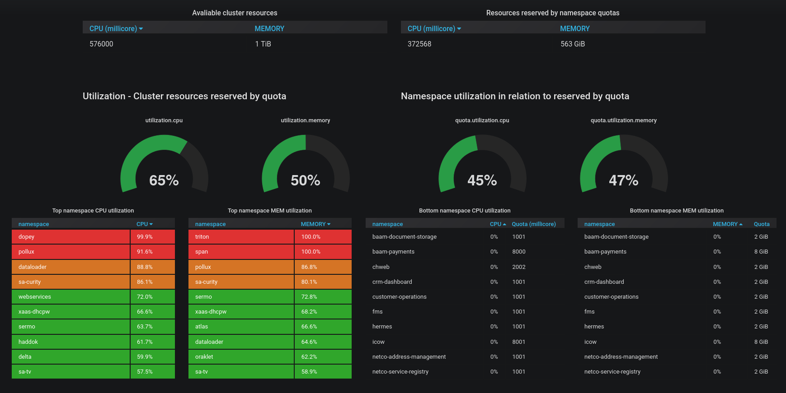

# dockeree-k8s-quota-monitoring
To calculate and visualize utilization of resource quotas in a Kubernetes cluster.  

## How it works
* Login to DockerEE
* Sums up worker nodes cpu & memory resources from `/nodes?filters=%7B%22role%22%3A%5B%22worker%22%5D%7D`
* Sums all namespace resource quota limits from `/api/v1/resourcequotas`
* Fetches namespace quota limits and current resource reservations from `/api/v1/resourcequotas`

Calculates cluster and namespace utilization before sending the result as json to Elasticsearch.   

## Requirements
* Elasticsearch for storing results
* Grafana for presentation (**optional**)

Requires the following environment variables to be set

>DOCKEREE_USERNAME

>DOCKEREE_PASSWORD

>DOCKEREE_HOST

>ELASTIC_USERNAME

>ELASTIC_PASSWORD

>ELASTIC_HOST

>ELASTIC_PORT
 
 Preferably with kubernetes secrets. Review `k8s/k8s_exaxmple.yaml` for example. 
 
**Note:** if Elasticsearch don't require auth you just set `DOCKEREE_USERNAME`and `DOCKEREE_PASSWORD`as `null`.
